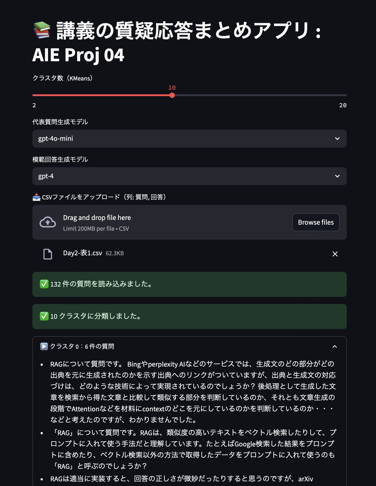

# 📚 講義の質疑応答まとめアプリ – AIE Proj 04

- 制作者：本多　郁（京都大学大学院情報学研究科 D3 / フリーランス AIエンジニア・データサイエンティスト）
- Slack名：Kaoru_Kyoto

受講者 9,000 人規模の大規模オンライン講義で **“質問対応が重すぎる”** という課題を  
<br>**AI × クラスタリング × 要約 + 模範回答生成** で解決する実践アプリです。



---

## 1. 何を解決するのか

| 現状の課題 | 本アプリの解決策 |
|------------|-----------------|
| - 講義 1 回で質問 100 件超、手作業では整理不能<br>- 回答品質を維持しつつ迅速に対応したい | 1. **OpenAI Embeddings** で質問をベクトル化<br>2. **KMeans** で似た質問を自動クラスタリング<br>3. GPT で代表質問を要約生成<br>4. GPT で模範回答を自動生成<br>5. 結果を **Markdown 一括 DL** |

---

## 2. 主な機能

| 機能 | 説明 |
|------|------|
| CSV アップロード | `質問, 回答` 列を持つ最大 1000 件の質問セットを読込 |
| クラスタ数スライダー | 2–20 クラスタを即時切替 |
| モデル選択 (UI) | 代表質問: `gpt-3.5-turbo / gpt-4o-mini / gpt-4`<br>模範回答: 同上 |
| 代表質問生成 | 質問リスト → GPT 要約（温度 0.5） |
| 模範回答生成 | 代表質問 → GPT 解答（温度 0.7） |
| Markdown DL | クラスタ単位で代表質問＋回答を保存 |
| 状態保持 | 生成済クラスタのみ自動展開、他は折り畳み |

---

## 3. アーキテクチャ

```mermaid
flowchart LR
    subgraph Streamlit UI
        A[CSV Upload] --> B[Embeddings<br>text-embedding-ada-002]
        B --> C[KMeans<br>scikit-learn]
        C --> D{Cluster n}
        D -->|代表質問| E[GPT<br>(summary_model)]
        D -->|模範回答| F[GPT<br>(answer_model)]
        E & F --> G[Markdown Export]
    end
